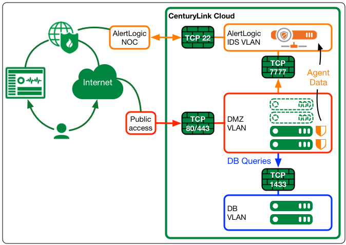
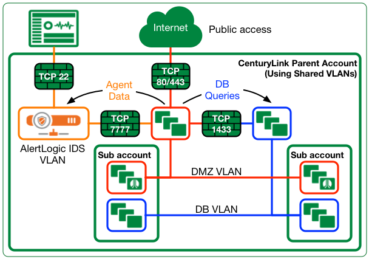

{{{
  "title": "Security with CenturyLink Cloud and AlertLogic Threat Manager",
  "date": "10-06-2015",
  "author": "Luis Cornejo",
  "attachments": [],
  "contentIsHTML": false,
  "sticky": false
}}}

**Introduction**|**Planing**|**Reference**
-----------------|------------|--------------
[Audience](#Audience)| [Deployment Scenarios](#Deployments)|
[Considerations](#Considerations)|
[Prerequisites](#Prerequisites)|
 

### Audience.

This article should assist individuals interested in data security and also IT professionals who are concerned about security threats and compliance whether an impending deployment is subject to regulation or not. This guide is not intended to be exhaustive, but it may rather be considered general advice given that security standards and threats continuously evolve. It is however, intended to provide a baseline in few areas of common security practices as a starting point for considerations prior to any implementation.

As with other CenturyLink Cloud ecosystem partners, the content of this guide is focused on the gained advantages by the inclusion of third party products and services in combination with CenturyLink Cloud features. It is intended to provide complementary measures to security policies, standards, and process developed in-house and it should not be considered a substitution of these.

**Category**|**Topics**
-------------|-----------------------------|
Security     |User access controls
|				  |Intrusion detection (IDS)
|				  |Log Management
|				  |Firewall rules & network zones

 
### Considerations.

Information about AlertLogic security products and services, additional references, and how to contact or purchase AlertLogic can be found in our [Public Knowledge Base](../Ecosystem%20Partners/Marketplace%20guides/getting-started-with-alert-logic-threat-manager-partner-template/).
 

AlertLogic's official documentation is available in their [Webhelp site](http://docs.alertlogic.com/).

#### Prerequisites.

* A Centurylink Cloud account.
* An AlertLogic account with activated *Threat Manager* services, *Log Manager* or both.
* Understanding of CenturyLink Cloud sub-account hierarchies for multi-tenant environments.

 
### What do AlertLogic products do?

### How does it work?

AlertLogic Threat manager and Log manager products work similarly within CenturyLink cloud. There are three required components to successfully benefit from AlertLogic's services:

**Component**|**Purpose**
-----------------|------------------------------
**Virtual Appliance**|Services as a centralized point for collection of events (threats and logs) and for management of the environment. The appliance can also provide signature updates and perform internal vulnerability assessments.
**Host Agent**|An individual software agent installed in each protected host, able to scan network packets and report threats that match AlertLogic's signatures and also can watch host logs and report events back to the appliance.
**AlertLogic Portal**|A centralized UI where a virtual appliance can report events to and where all collected security information is consolidated.

 

### 1. Planning a deployment.

### 2. Deployment Scenarios

#### a) Single tenant

#### b) Multi-tenant

### 3. Deploy

 

### Resources

#### Vendor documentation

[AlertLogic Threat Manager Documentation](http://docs.alertlogic.com/#docs/threat_manager/about_threat_manager.htm%3FTocPath%3DThreat%2520Manager%7C_____0)

[AlertLogic Log Manager Documentation](http://docs.alertlogic.com/#docs/log_manager/about_log_manager.htm#get%3FTocPath%3DLog%2520Manager%7C_____0)